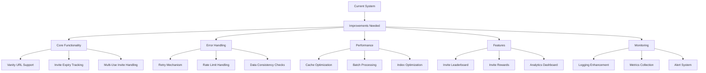

# Invite Manager System Improvement Plan

## Overview

This document outlines the comprehensive plan for improving the Discord.js v14 invite manager system. The improvements focus on making the system more robust, accurate, and feature-rich.



## 1. Core Functionality Improvements

### 1.1 Vanity URL Support

- Add dedicated handling for vanity URLs in the `findUsedInvite()` method
- Implement separate tracking for vanity URL usage statistics
- Integrate vanity URL data into user invite statistics
- Add vanity URL permission checks

### 1.2 Invite Expiry Tracking

- Enhance the invite schema with expiry timestamp field
- Implement automatic cleanup for expired invites
- Add notifications for soon-to-expire invites
- Handle temporary invite tracking more effectively

### 1.3 Multi-Use Invite Handling

- Improve tracking accuracy for invites with maxUses limit
- Implement notifications when invites approach their usage limit
- Add duplicate use detection and prevention
- Track invite usage patterns

## 2. Error Handling & Recovery

### 2.1 Robust Retry Mechanism

```javascript
const retryOperation = async (
  operation,
  maxRetries = 3,
  initialDelay = 1000
) => {
  for (let i = 0; i < maxRetries; i++) {
    try {
      return await operation();
    } catch (error) {
      if (i === maxRetries - 1) throw error;
      await new Promise((resolve) =>
        setTimeout(resolve, initialDelay * Math.pow(2, i))
      );
    }
  }
};
```

### 2.2 Rate Limit Handling

- Implement Discord API rate limit detection
- Add request queuing system for API calls
- Cache frequently accessed data
- Add rate limit monitoring and alerts

### 2.3 Data Consistency

- Implement periodic cache validation
- Add data repair mechanisms for inconsistent states
- Create integrity checks for invite statistics
- Add automated recovery procedures

## 3. Performance Optimization

### 3.1 Cache Management

- Implement LRU (Least Recently Used) cache for invite data
- Add cache warming on bot startup
- Optimize cache update mechanisms
- Implement efficient cache invalidation

### 3.2 Database Optimization

- Add batch processing for statistics updates
- Implement database connection pooling
- Optimize MongoDB queries with proper indexing
- Add database query monitoring

### 3.3 Memory Management

- Implement memory-efficient data structures
- Add garbage collection for old invite data
- Optimize collection sizes
- Monitor memory usage

## 4. New Features

### 4.1 Enhanced Statistics System

```javascript
const inviteAnalytics = {
  hourly: {
    invites: Map<hour, count>,
    success_rate: number,
    peak_times: Array<time>
  },
  daily: {
    total: number,
    unique_users: number,
    conversion_rate: number
  },
  weekly: {
    growth: number,
    trends: Array<trend>,
    patterns: Object
  },
  topInviters: {
    daily: Array<user>,
    weekly: Array<user>,
    allTime: Array<user>
  }
};
```

### 4.2 Reward System

- Implement configurable milestone rewards
- Add achievement system for invite goals
- Create invite-based role assignment
- Add customizable reward messages

### 4.3 Admin Dashboard

- Add comprehensive invite management commands
- Implement configurable invite policies
- Create monitoring dashboard
- Add invite analytics visualization

## 5. Monitoring & Logging

### 5.1 Enhanced Logging

```javascript
const logInviteEvent = (eventType, data, metadata) => {
  Logger.info({
    type: eventType,
    data,
    metadata,
    timestamp: new Date(),
    environment: process.env.NODE_ENV,
    performance: {
      duration: metadata.duration,
      memory: process.memoryUsage(),
    },
  });
};
```

### 5.2 Metrics Collection

- Track detailed invite usage patterns
- Monitor system performance metrics
- Collect error statistics and patterns
- Implement performance benchmarking

### 5.3 Alerting System

- Add critical error alerts
- Implement threshold-based notifications
- Create status reporting system
- Add Discord channel notifications

## 6. Schema Updates

### 6.1 Enhanced Invite Schema

```javascript
const enhancedInviteSchema = {
  guildId: String,
  inviterId: String,
  code: String,
  uses: Number,
  maxUses: Number,
  expiresAt: Date,
  isVanity: Boolean,
  isTemporary: Boolean,
  metadata: {
    source: String,
    campaign: String,
    notes: String,
  },
  analytics: {
    hourlyUses: Map,
    conversionRate: Number,
    lastUsed: Date,
  },
  tracking: {
    created: Date,
    lastUpdated: Date,
    status: String,
  },
};
```

## Implementation Strategy

### Phase 1: Core Improvements (Weeks 1-2)

1. Fix existing bugs in tracking system
2. Implement retry mechanisms
3. Add basic monitoring
4. Improve error handling

### Phase 2: Performance Optimization (Weeks 3-4)

1. Optimize caching system
2. Improve database queries
3. Implement batch processing
4. Add performance monitoring

### Phase 3: New Features (Weeks 5-6)

1. Implement reward system
2. Add enhanced analytics
3. Create admin controls
4. Build basic dashboard

### Phase 4: Monitoring & Maintenance (Weeks 7-8)

1. Deploy comprehensive logging
2. Implement metrics collection
3. Set up alerting system
4. Add documentation

## Testing Strategy

1. Unit Tests

   - Core invite tracking functions
   - Data consistency checks
   - Error handling scenarios

2. Integration Tests

   - API interaction tests
   - Database operations
   - Cache management

3. Load Tests

   - High-volume invite creation
   - Concurrent user joins
   - Cache performance

4. Monitoring Tests
   - Alert system verification
   - Logging accuracy
   - Metric collection

## Maintenance Plan

1. Regular Monitoring

   - Daily performance checks
   - Weekly statistics review
   - Monthly system audit

2. Updates

   - Bi-weekly dependency updates
   - Monthly feature updates
   - Quarterly major reviews

3. Backup Strategy
   - Daily database backups
   - Weekly configuration backups
   - Monthly full system backup

## Success Metrics

1. Performance

   - Response time < 100ms
   - 99.9% tracking accuracy
   - < 1% error rate

2. Scalability

   - Support for 100+ concurrent joins
   - Handle 10,000+ invites per guild
   - Efficient memory usage < 500MB

3. User Satisfaction
   - Reduced support tickets
   - Increased feature usage
   - Positive user feedback

## Future Considerations

1. API Extensions

   - REST API for statistics
   - Webhook integration
   - External service integration

2. Advanced Features

   - AI-powered invite analysis
   - Fraud detection system
   - Advanced analytics dashboard

3. Integration Opportunities
   - Member verification integration
   - Role management system
   - Welcome message customization
