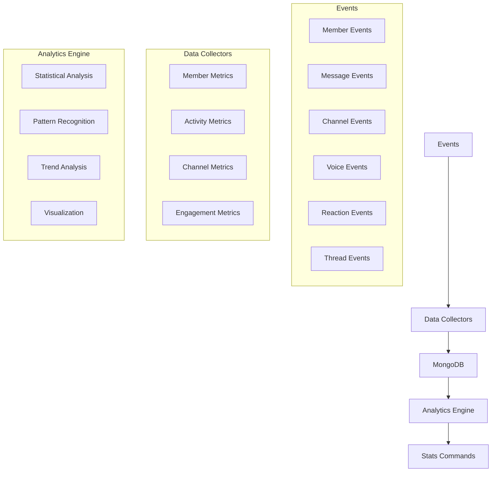

# Server Statistics System Technical Documentation

## Overview

A comprehensive statistics and analytics system for Discord servers that tracks member activity, server growth, and engagement patterns while ensuring data privacy and system performance.

## Core Components

### 1. Data Collection System



### Database Schemas

#### 1. MemberActivityStats

```typescript
{
  guildId: String,
  userId: String,
  joinTimestamp: Date,
  leaveHistory: [{
    leftAt: Date,
    rejoinedAt: Date
  }],
  messageStats: {
    totalCount: Number,
    firstMessageTimestamp: Date,
    lastMessageTimestamp: Date,
    channelDistribution: Map<ChannelId, Number>,
    hourlyActivity: Map<Hour, Number>, // 0-23
    weeklyActivity: Map<Day, Number>,  // 0-6
    reactionCount: {
      given: Number,
      received: Number
    }
  },
  voiceStats: {
    totalMinutes: Number,
    channelMinutes: Map<ChannelId, Number>,
    lastActive: Date,
    hourlyActivity: Map<Hour, Number>,
    weeklyActivity: Map<Day, Number>
  },
  threadParticipation: {
    created: Number,
    joined: Number,
    messagesInThreads: Number
  },
  lastActive: Date,
  activityScore: Number // Calculated based on multiple factors
}
```

#### 2. GuildActivitySnapshot

```typescript
{
  guildId: String,
  timestamp: Date,
  interval: String, // '1h', '1d', '1w', '1m'
  metrics: {
    members: {
      total: Number,
      active: Number, // message/voice in last 7 days
      voice: Number,  // currently in voice
      messageAuthors: Number // unique message senders
    },
    messages: {
      total: Number,
      perChannel: Map<ChannelId, Number>,
      withFiles: Number,
      withEmbeds: Number,
      withStickers: Number,
      withReactions: Number
    },
    voice: {
      totalMinutes: Number,
      perChannel: Map<ChannelId, Number>,
      peakConcurrent: Number
    },
    threads: {
      active: Number,
      created: Number,
      archived: Number,
      messageCount: Number
    },
    channels: {
      categories: Number,
      text: Number,
      voice: Number,
      stage: Number,
      forum: Number
    }
  },
  activityHeatmap: {
    hourly: Map<Hour, Number>,
    daily: Map<Day, Number>
  }
}
```

#### 3. ChannelStats

```typescript
{
  guildId: String,
  channelId: String,
  type: String, // 'TEXT', 'VOICE', 'THREAD', 'FORUM'
  metrics: {
    messageCount: Number,
    uniqueAuthors: Number,
    attachmentCount: Number,
    reactionCount: Number,
    threadCount: Number,
    voiceMinutes: Number,
    uniqueVoiceUsers: Number,
    peakConcurrentUsers: Number
  },
  hourlyActivity: Map<Hour, Number>,
  weeklyActivity: Map<Day, Number>,
  lastActive: Date
}
```

### 2. Command Interface

#### /serverstats

- Primary command for accessing server statistics
- Multiple subcommands and options:

```typescript
/serverstats overview [timeframe]
/serverstats members [category] [timeframe]
/serverstats activity [type] [timeframe]
/serverstats channels [category] [timeframe]
/serverstats trends [metric] [timeframe]
```

Components:

- Dropdown menus for filtering
- Interactive buttons for navigation
- Progress bars for metrics
- Embed field layouts for data presentation
- Modal forms for complex queries

#### /activity analyze

Advanced analysis options:

```typescript
/activity analyze member [user] [timeframe]
/activity analyze channel [channel] [metric] [timeframe]
/activity analyze comparative [metric] [timeframe]
```

Features:

- Detailed member activity analysis
- Channel performance metrics
- Comparative statistics
- Custom timeframe selection
- Export options for data

### 3. Analytics Features

#### Member Analytics

- Active vs Inactive ratios
- Engagement patterns
- Activity score calculation
- Participation trends
- Voice activity tracking

#### Channel Analytics

- Usage patterns
- Peak activity times
- Content type distribution
- Thread engagement
- Voice channel utilization

#### Server Trends

- Growth trajectory
- Activity cycles
- Engagement fluctuations
- Feature usage trends
- Community health indicators

### 4. Implementation Details

#### Event Handlers

1. Member Events:

```javascript
// guildMemberAdd
- Create/update member record
- Start tracking session

// guildMemberRemove
- Update leave history
- Calculate retention period
- Archive stats
```

2. Message Events:

```javascript
// messageCreate
- Update message counts
- Track channel distribution
- Record timing patterns
- Calculate activity scores

// messageReactionAdd/Remove
- Track reaction engagement
- Update interaction metrics
```

3. Voice Events:

```javascript
// voiceStateUpdate
- Track session duration
- Monitor channel popularity
- Record peak usage times
```

#### Performance Optimizations

1. Data Storage:

- Implement TTL indexes
- Use bulk operations
- Periodic aggregation
- Efficient indexing

2. Memory Management:

- LRU cache implementation
- Batch processing
- Stream-based updates
- Pruning old data

3. Query Optimization:

- Aggregation pipelines
- Cached common queries
- Indexed search fields
- Parallel processing

### 5. Privacy & Security

#### Data Protection

- No message content storage
- Aggregated statistics only
- Anonymized user data
- Configurable retention periods

#### Access Control

- Role-based permissions
- Admin-only commands
- Audit logging
- Data access tracking

## Implementation Phases

### Phase 1: Foundation (Week 1-2)

- Set up database schemas
- Implement core event handlers
- Create basic data collectors

### Phase 2: Data Collection (Week 3-4)

- Deploy all event listeners
- Implement aggregation system
- Set up periodic snapshots

### Phase 3: Analytics (Week 5-6)

- Build statistical models
- Implement trend analysis
- Create visualization system

### Phase 4: Interface (Week 7-8)

- Develop slash commands
- Create interactive components
- Build admin dashboard

## Technical Requirements

### Discord.js v14 Features

- Utilize new permission system
- Implement slash command builders
- Use button interactions
- Leverage thread features
- Modal form integration

### Database Optimization

- Indexed queries
- Caching strategy
- Backup system
- Data archival

### Error Handling

- Graceful degradation
- Retry mechanisms
- Error logging
- Status monitoring

## Future Enhancements

### Potential Features

- AI-powered trend prediction
- Custom report generation
- Integration with external tools
- Advanced visualization options
- Comparative server analytics

### Scalability Plans

- Horizontal scaling
- Query optimization
- Cache improvements
- Data partitioning

## Notes

- Regular performance monitoring required
- Monthly data cleanup recommended
- Backup strategy implementation
- Regular schema optimization
