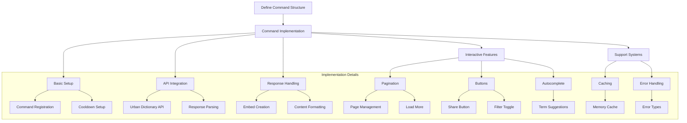

# Urban Dictionary Definition Command Implementation Plan

## Overview

A Discord slash command that provides Urban Dictionary definitions with rich formatting, pagination, and interactive features.

## Command Structure



## File Structure

```
Commands/
└── Slash/
    └── Utils/
        └── define.js              # Main command file
utils/
└── defineUtils/
    ├── cache.js           # In-memory caching
    ├── urbanApi.js        # API wrapper
    └── embedBuilder.js    # Embed formatting
```

## Implementation Details

### 1. Command Structure

```javascript
export default {
  name: "define",
  category: "Utils",
  cooldown: 30, // 30 second cooldown between uses
  data: new SlashCommandBuilder()
    .setName("define")
    .setDescription("Look up a term on Urban Dictionary")
    .addStringOption((option) =>
      option
        .setName("term")
        .setDescription("The term to search for")
        .setRequired(true)
        .setAutocomplete(true)
    )
    .addBooleanOption((option) =>
      option
        .setName("filter")
        .setDescription("Enable content filtering")
        .setRequired(false)
    ),

  run: async ({ interaction }) => {
    await interaction.deferReply();
    // Implementation
  },
};
```

### 2. Core Features

- **Pagination System**: Navigation through definitions using buttons
- **Load More**: Option to fetch additional definitions beyond initial 10
- **Content Filtering**: Toggle for NSFW content
- **Caching**: 24-hour cache for frequently requested terms
- **Auto-complete**: Suggestions while typing search terms
- **Error Handling**: Custom error types for different scenarios

### 3. Technical Specifications

#### Caching

- TTL: 24 hours
- Storage: In-memory Map
- Invalidation: Automatic expiry

#### Pagination

- Initial Load: Up to 10 definitions
- Load More: Fetch additional definitions on demand
- Timeout: 2 minutes
- Button Types: Previous, Next, Load More, Share

#### API Integration

- Endpoint: Urban Dictionary API
- Error Handling: Custom error types
- Response Format: JSON parsing

### 4. Embed Format

```javascript
{
  title: `📚 ${term}`,
  description: definition,
  fields: [
    { name: '📝 Example', value: example },
    { name: '📊 Stats', value: `👍 ${thumbsUp} | 👎 ${thumbsDown}` },
    { name: '📅 Submitted', value: submissionDate }
  ],
  footer: {
    text: `Page ${currentPage}/${totalPages} • Use 'Load More' to see additional definitions`
  }
}
```

## Error Handling Strategy

1. **API Errors**

   - Network failures
   - Invalid responses
   - No results found

2. **User Input**

   - Invalid terms
   - Malformed requests

3. **Cache Errors**
   - Cache misses
   - Invalidation errors

## Implementation Phases

### Phase 1: Foundation

1. Basic command structure
2. API integration
3. Response formatting

### Phase 2: Interactive Features

1. Pagination system with Load More
2. Auto-complete
3. Content filtering

### Phase 3: Optimization

1. Caching system
2. Error handling
3. Performance tuning

## Testing Scenarios

1. **Basic Functionality**

   - Single definition lookup
   - Multiple definition navigation
   - Loading additional definitions
   - Content filtering

2. **Edge Cases**

   - No results found
   - API unavailable
   - Invalid terms

3. **Performance**
   - Cache hit/miss ratio
   - Response time
   - Memory usage

## Future Enhancements

1. **Extended Features**

   - Definition voting
   - Personal favorites
   - Custom filters

2. **Optimizations**
   - Persistent caching
   - Performance monitoring
   - Enhanced error reporting
